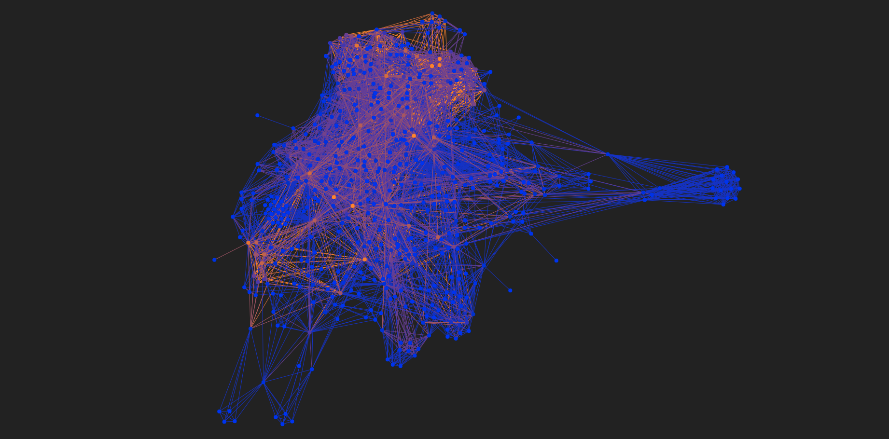

Tagnet: a CLIP tags exploration tool
====================================

Introduction
------------

`CLIP <https://openai.com/blog/clip/>`__ and `VQGan <https://compvis.github.io/taming-transformers/>`_ allow you to generate beautiful images from text.
The descriptions of these images should be more specific than in natural language and are called prompts [#f1]_.
The goal I have while making this document and code is to document how to reach the best results using prompts.

At Jun 1st., 2021, `Aran Komatsuzaki <https://twitter.com/arankomatsuzaki>`_ `tweeted <https://twitter.com/arankomatsuzaki/status/1399471244760649729?lang=en>`_ that mentioning "`Unreal Engine <https://www.unrealengine.com/>`_" changes the visual style and quality of an image. Since `CLIP <https://github.com/openai/CLIP>`__ learned on the images from the Internet, the "`Unreal Engine <https://www.unrealengine.com/>`_" can be called one of its many sources of inspiration. Even before that, many looked for tags, words that change how `CLIP <https://github.com/openai/CLIP>`__ draws things.

I've experimented with many `CLIP <https://github.com/openai/CLIP>`__ prompts using
a Discord bot by `BoneAmputee <https://twitter.com/boneamputee>`_ and decided to build a list of words I use often.

Then I experimented more, especially with a pencil style and understood I will need more than one list, because co-occurences of the words create a `graph <https://en.wikipedia.org/wiki/Graph_(discrete_mathematics)>`_! I have also added many prompts by other users, often with some editing and pre-processing to make them more uniform.
The :code:`prompts` directory contains two files with mostly cleaned up prompt samples.

.. toctree::
   :maxdepth: 2
   :caption: Contents:

   uses
   code/code
   plans

.. rubric:: Footnotes

.. [#f1] ArXiV: `Prompt Programming for Large Language Models: Beyond the Few-Shot Paradigm <https://arxiv.org/pdf/2102.07350.pdf>`_ by Laria Reynolds and Kyle McDonell
