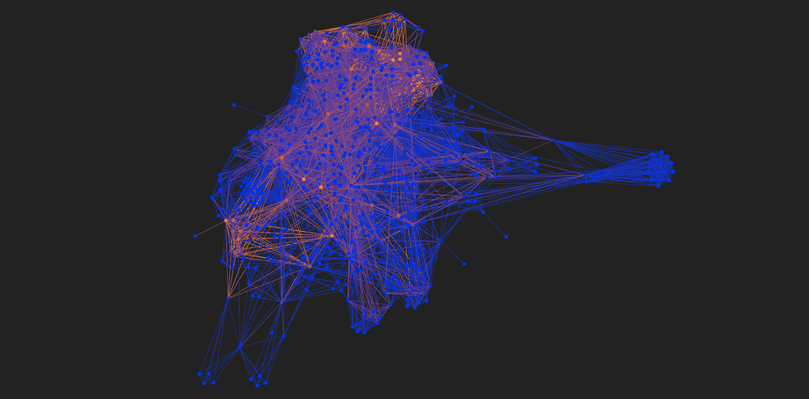

Uses
====

Counting tags
-------------

The basic use for the :code:`tagnet` utility is to count tags and display the counted occurences
for each of the tags.

You need to provide a directory with text files containing the prompts in a :code:`path` command-line argument.

.. code-block:: shell

    tagnet.py --path ./prompts --mode count_tags

Filtering
^^^^^^^^^

You may also need to filter tags by the number of occurences.

For now, these are the supported modes (you can put whitespaces between mode and a number):

:code:`=`, :code:`>`, :code:`<`, :code:`>=`, :code:`<=`

**Examples**:

.. code-block:: shell

    tagnet.py --mode count_tags --filter "=1"

.. code-block:: shell

    tagnet.py --path ./prompts --mode count_tags --filter ">1"

.. code-block:: shell

    tagnet.py --path ./prompts --mode count_tags --filter "< 3"

.. code-block:: shell

    tagnet.py --path ./prompts --mode count_tags --filter "<= 8"

.. code-block:: shell

    tagnet.py --path ./prompts --mode count_tags --filter ">=5"

Tag graph
---------

Displaying an approximate graph
^^^^^^^^^^^^^^^^^^^^^^^^^^^^^^^

Often, a prompt contains several tags, for example:

.. code-block:: text

    Sunset in a forest ; VRay ; 3D ; High detail

We've got two co-occurences:

* :code:`VRay` and :code:`3D`
* :code:`High detail` and :code:`3D`

Edges for this command are weighted, based on an amount of said co-occurences in all available prompts.

To generate and see it, write:

.. code-block:: shell

    tagnet.py --mode display_graph --path ./prompts

The graph is using Matplotlib and WxWidges and looks like that.

Displaying a web graph
^^^^^^^^^^^^^^^^^^^^^^

There's a frontend side of the project: `CLIP graph visualized <https://github.com/6r1d/CLIP_graph_visualized>`_.
You may want to watch an `online demo <https://6r1d.github.io/CLIP_graph_visualized/index.html>`_ with existing tags
or build your own tag graph and watch how it differs:

.. code-block:: shell

    # Replace "your_path" with a path containing prompt directory and available for JSON file export
    # --path is a prompt directory
    # --output_file is a path to a new JSON output file
    tagnet.py --path ~/your_path/prompt_directory --mode export_graph --output_file ~/your_path/graph.json

Now you can clone the visualization repository to use it locally and copy the generated :code:`graph.json` as a data source.

.. code-block:: shell

    # Clone a repository
    git clone git@github.com:6r1d/CLIP_graph_visualized.git
    cd CLIP_graph_visualized

    # Copy a graph.json
    cp ~/your_path/graph.json ./graph.json

    # Run a Python 3 webserver locally on a 8080 port
    # (any other webserver with static file support might work)
    python3 -m http.server --bind 0.0.0.0 8080

Now, by visiting "http://0.0.0.0:8080" or "http://127.0.0.1:8080", you'll be able to see your own graph version.
The visualizer is using a `force-graph <https://github.com/vasturiano/force-graph>`_ library by `Vasco Asturiano <https://github.com/vasturiano>`_.
It allows you to zoom in and out, see tag names and shift the workspace.

